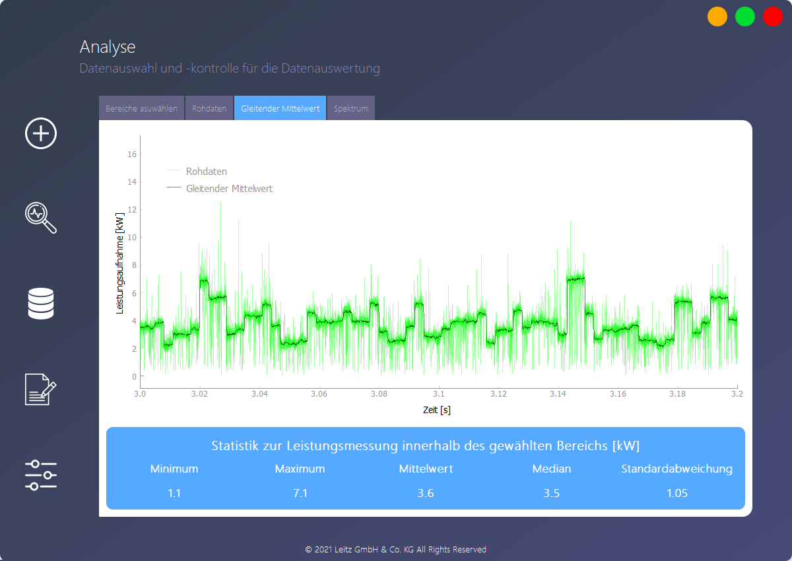
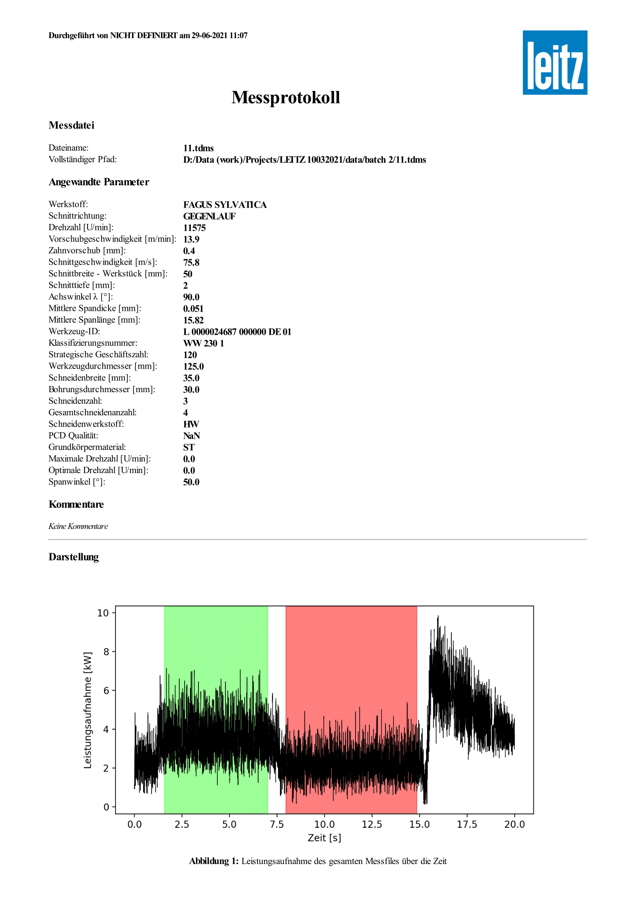
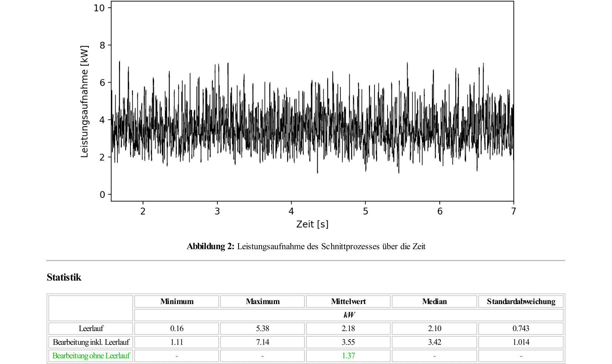
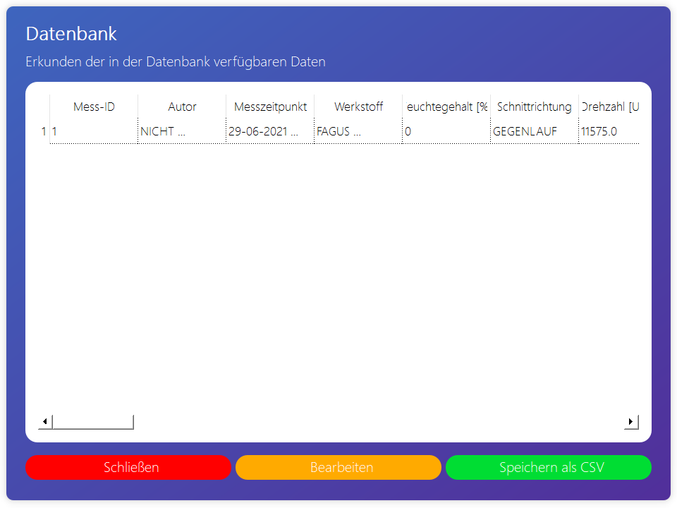
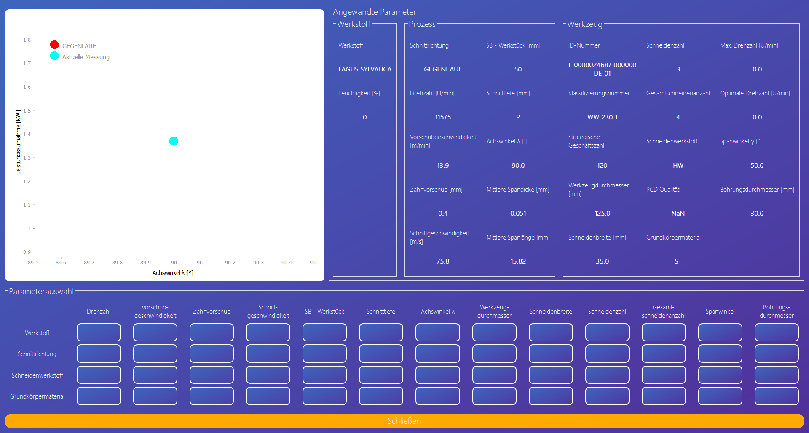
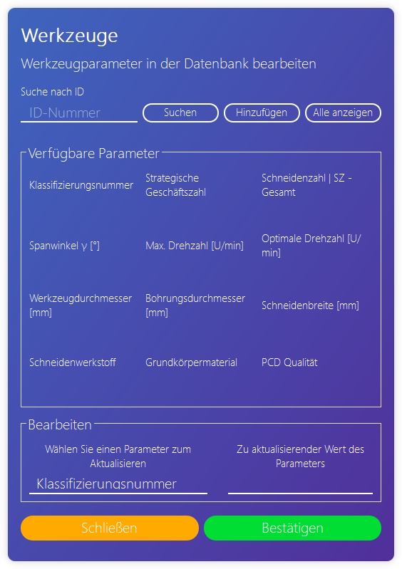

<br/>
<p align="center"> 
  
</p>

# Power Analytics

<p align="justify">
Toolkit for power consumption analysis for the manufacturer of woodworking tools
</p>

## Table of Contents

- [Introduction](#introduction)
  - [What is Power Analytics?](#what-is-power-analytics)
  - [What can Power Analytics do?](#what-can-power-analytics-do)
- [Installation](#installation)
- [Overview](#overview)
  - [Main view](#main-view)
  - [Importing data and entering parameters](#importing-data-and-entering-parameters)
  - [Range selection and signal visualization](#range-selection-and-signal-visualization)
  - [Report](#report)
  - [Database](#database)
  - [Settings](#settings)
- [Troubleshooting](#troubleshooting)
- [Acknowledgements](#acknowledgements)

## Introduction

### What is Power Analytics?

<p align="justify">
The application was developed to enable knowledge extraction from data produced during wood and wood-based material cutting experiments. The application is connected to a local database in which all the performed measurements are stored. Each record stores the parameters and the dependent variable, which is the power consumption of the woodworking machine. The parameters can be divided into three subgroups:
</p>

- parameters related to the material being cut itself,
- parameters related to the cutting process,
- parameters related to the cutting tool.

<p align="justify">
Due to the multitude of parameters, multivariate analysis and - in the long term - tool optimization are possible.
</p>

### What can Power Analytics do?

<p align="justify">
Some of the features of the software are as follows:
</p>

- modern and user-friendly graphic interface
- storage of all measurements in a database allowing for gradual increase of knowledge
- storing tools in the database and tracking and saving the changes made, which prevents the loss of data when updating the database with new data from the main enterprise system
- database records can be customized
- available data can be exported in CSV format for further analysis (both data from the database and data from the charts)
- available graphs can be saved in a variety of formats, including vector graphics formats; the range of graphs can be manually adjusted, saving only the interesting parts
- after each measurement a report is generated in PDF format, containing used parameters, graphs and basic statistics
- it is possible to view historical reports - the reports are saved by default, so that access to them is guaranteed at any time
- intuitive graphical interface for multi-parameter data visualization enables easy browsing of available measurements and searching for potential correlations

## Installation

### Tested on 64-bit version of Windows 10

<p align="justify">
To install the software, follow the bulleted steps:
</p>

- download the installer [here](https://github.com/daniellechowicz/power-analytics/raw/main/Power%20Analytics.exe)
- run the installer and follow the instructions displayed in the installer window
- if the Python interpreter (version 3.9.0) is not installed on your computer, make sure that the installation of this program is checked
- after the installation is complete, go to the <i>bin</i> folder and launch the application by double clicking on the icon

<p align="center"> 
  
  <p align="center">
    Fig. 1. Make sure that Python 3.9.0 will be added to system's <i>PATH</i> variable; if admin rights are unavailable, then <i>Install launcher for all users (recommended)</i> must be unchecked
  </p>
</p>

## Overview

<p align="justify"> 
This chapter describes an example use of the software and the procedure to analyze the data. A detailed description of the various functionalities is described in the next section.
</p>

### Main view

<p align="justify">
After launching the application, you will see the main window from which you can navigate to the various functionalities of the software. The tabs shown on the left are:
</p>

- data import and parameter entry,
- cutting and idle range selection and signal analysis including spectrum visualization,
- database and multi-parameter data visualization,
- reporting,
- settings.

<p align="center"> 
  
  <p align="center">
    Fig. 2. Power Analytics
  </p>
</p>

### Importing data and entering parameters

<p align="justify">
Head to the first tab and then enter the path to the measurement file. If you do not have any measurement files in TDMS format, go to the _samples_ folder, which contains sample files. Confirm your selection. The next step is to enter the measurement parameters, including:
</p>

- author,
- material,
- material moisture content,
- rotational speed,
- feed speed,
- cutting width,
- cutting depth,
- tool ID,
- comment.

<p align="justify">
Mandatory fields are marked with an asterisk. To avoid conflicts related to different data types, special validators have been added to allow the use of specific data types. Validators allow only one special character (comma; no other special characters are allowed, making fields error-proof). The data types for each field are as follows:
</p>

- author: <i>any</i>,
- material: <i>string</i>,
- material moisture content: <i>integer</i>,
- rotational speed: <i>float</i>,
- feed speed: <i>float</i>,
- cutting width: <i>float</i>,
- cutting depth: <i>float</i>,
- tool ID: <i>any</i>,
- comment: <i>any</i>.

<p align="justify"> 
Once the parameters have been entered, it is necessary to confirm them and then move on to the next tab by clicking the confirm button located on the right side of the window.
</p>

<p align="center"> 
  
  <p align="center">
    Fig. 3. Import page
  </p>
</p>

<p align="center"> 
  
  <p align="center">
    Fig. 4. Parameters widget
  </p>
</p>

<p align="justify">
Since many of the parameters are categorical variables, it was necessary to limit the choices (due to the functionality described later in the documentation, which is multiparameter visualization). This includes material, cutting direction, and tool ID. 
</p>

<p align="justify">
The material must first be defined by going to the next window by pressing the <i>Bearbeiten</i> button. By default the software uses capital letters, so the font does not play an important role. After adding material, reset parameters window to refresh database with available materials. When you want to remove some material from the database, open again the window, enter the name of the material you want to remove and then press the <i>Löschen</i> button.
</p>

<p align="center"> 
  
  <p align="center">
    Fig. 5. Edit materials widget
  </p>
</p>

### Range selection and signal visualization

<p align="justify"> 
The next step required for a correct analysis is to mark the idle and cutting ranges. The main widget consists of three smaller charts. The first chart corresponds to the chart that is used to select the cutting and idle ranges. The second chart corresponds to the idle process, and the third chart, located at the bottom, corresponds to cutting. The graphs are responsive and update as the user makes changes.
</p>

<p align="justify"> 
The green rectangle is for cutting and the red rectangle is for idle process. The rectangles can be moved and stretched as desired. If a range outside the signal is selected, the indexes are assigned accordingly depending on the position of the rectangle (there is an appropriate function that takes care of validating the selected ranges and, in case of incorrect ranges, adjusts them accordingly to the analyzed signal).
</p>

<p align="justify"> 
Check or uncheck the checkbox next to the button, depending on your intention for the analysis. If the checkbox is unchecked, the data will not be added to the database, but you can still generate a report. Once you have made your selection, confirm it by clicking on the button below the graphs.
</p>

<p align="justify"> 
After confirming, a report is generated in the background and you are taken to the next view which is a visualization of the filtered signal. Two more views are available: the raw data visualization and the visualization of the signal transformed to the frequency domain.
</p>

<p align="justify"> 
<b>Tip I:</b> you can zoom in and out by holding down the right mouse button and moving the mouse up and down (increase or decrease the amplitude, respectively) or right and left (increase or decrease the range of the visible window, respectively).
</p>

<p align="justify"> 
<b>Tip II:</b> by pressing the right mouse button on the chart, additional options appear that may be useful to you. The options are as follows:
</p>

- <i>View All</i>
- <i>X Axis</i>
- <i>Y Axis</i>
- <i>Mouse Mode</i>
  - <i>3 Button</i>
  - <i>1 Button</i>
- <i>Plot Options</i>
  - <i>Transforms</i>
    - <i>Power Spectrum (FFT)</i>
    - <i>Log X</i>
    - <i>Log Y</i>
    - <i>dy/dx</i>
    - <i>Y vs. Y'</i>
  - <i>Downsample</i>
  - <i>Average</i>
  - <i>Alpha</i>
  - <i>Grid</i>
  - <i>Points</i>
- <i>Export</i>

<p align="center"> 
  
  <p align="center">
    Fig. 6. Range selection
  </p>
</p>

<p align="center"> 
  
  <p align="center">
    Fig. 7. Signal visualization: green - raw data, black - moving average
  </p>
</p>

<p align="center"> 
  
  <p align="center">
    Fig. 8. Raw signal visualization
  </p>
</p>

<p align="center"> 
  
  <p align="center">
    Fig. 9. Spectrum visualization
  </p>
</p>

<p align="center"> 
  
  <p align="center">
    Fig. 10. Export window - both numerical data and graphs in various formats can be exported
  </p>
</p>

### Report

<p align="justify"> 
The software has the functionality of generating reports.Reports are generated automatically (saved in the project folder for later use to open historical reports directly from the database), as well as on user request with saving in a defined folder (appropriate icon in the left sidebar). A sample auto-generated report is shown below.
</p>

<p align="center">
  
  
  <p align="center">
    Fig. 11. Sample auto-generated report
  </p>
</p>

### Database

<p align="justify"> 
Database related functionality is also available to the user. There are three databases in which the following parameters are stored:
</p>

- metadata
  - measurement ID
  - author
  - measurement date
  - material
  - moisture content [%]
  - cutting direction
  - rotational speed [U/min]
  - feed speed [m/min]
  - feed per tooth [mm]
  - cutting speed [m/s]
  - cutting width [mm]
  - cutting depth [mm]
  - mean chip thickness [mm]
  - mean chip length [mm]
  - tool ID
  - classification number
  - strategic business unit
  - tool diameter [mm]
  - tool cutting width [mm]
  - bore diameter [mm]
  - number of wings
  - total number of wings
  - cutting material
  - cutting material quality
  - body material
  - maximum rotational speed [U/min]
  - optimum rotational speed [U/min]
  - rake angle [°]
  - shear angle [°]
  - comments
- statistics
  - idle
    - maximum power consumption [kW]
    - minimum power consumption [kW]
    - median power consumption [kW]
    - mean power consumption [kW]
    - standard deviation of power consumption [kW]
  - cutting
    - maximum power consumption [kW]
    - minimum power consumption [kW]
    - median power consumption [kW]
    - mean power consumption [kW]
    - standard deviation of power consumption [kW]
  - cutting (no idle)
    - mean power consumption [kW]
- materials
  - material ID
  - material

<p align="justify"> 
The first two databases (i.e. <i>metadata</i> and <i>statistics</i>) can be seen in the window under <i>Datenbank</i>. The third database (i.e. <i>materials</i>) is only used in the parameters window.
</p>

<p align="justify"> 
Navigating to the database window displays all the records available in the database. The records can be edited by pressing the <i>Bearbeiten</i> button, or exported in CSV format for further analysis by pressing the <i>Speichern als CSV</i> button. In order to edit a record, it is necessary to enter the ID number of the measurement, as well as to indicate the field you want to edit and to enter a new value. It is also possible to view old reports, which are stored in the folder <i>reports</i> in the project path. To view a report, press the record index on the left.
</p>

<p align="justify"> 
Below is a sample line from the CSV file that resulted from exporting the database:
</p>

```
measurement_id,author,measurement_date,material,moisture_content,cutting_direction,rotational_speed,feed_speed,feed_per_tooth,cutting_speed,cutting_width,cutting_depth,shear_angle,mean_chip_thickness,mean_chip_length,tool_id,classification_number,strategic_business_unit,tool_diameter,tool_cutting_width,bore_diameter,no_of_wings,total_no_of_wings,cutting_material,cutting_material_quality,body_material,n_max,n_opt,rake_angle,comments,report_name,min_idle,max_idle,mean_idle,median_idle,std_idle,min_cutting,max_cutting,mean_cutting,median_cutting,std_cutting,mean_cutting_no_idle
1,NICHT DEFINIERT,29-06-2021 11:07,FAGUS SYLVATICA,0,GEGENLAUF,11575.0,13.9,0.4,75.8,50.0,2.0,90.0,0.051,15.82,L 0000024687 000000 DE 01,WW 230 1,120,125.0,35.0,30.0,3,4,HW,NaN,ST,0.0,0.0,50.0,Keine Kommentare,Report 29-06-2021.pdf,0.16,5.38,2.18,2.1,0.743,1.11,7.14,3.55,3.42,1.014,1.37
```

<p align="center">
  
  <p align="center">
    Fig. 12. Database
  </p>
</p>

<p align="center">
  
  <p align="center">
    Fig. 13. Database edit
  </p>
</p>

### Multiparameter visualization

<p align="justify"> 
Within the visualization, it is possible to extract knowledge quickly and easily from the data collected in the database. At the bottom of the screen are buttons that are designed in the style of a coordinate system. Categorical variables are placed on the Y axis of the imaginary coordinate system and numerical variables are placed on the X axis. The categorical variables include: 
</p>

- material
- cutting direction
- cutting material
- tool body material

<p align="justify"> 
The numerical variables, on the other hand, include:
</p>

- rotational speed
- feed speed
- feed per tooth
- cutting speed
- cutting width
- cutting depth
- shear angle
- tool diameter
- tool cutting width
- number of wings
- total number of wings
- rake angle
- bore diameter

<p align="justify">
By pressing a given button, the corresponding visualization (according to an imaginary coordinate system) will be displayed.
</p>

<p align="justify">
In the upper right corner of the window you can also see the parameters, which are divided into three groups: material, process and tool. These parameters are taken when entering data in the parameters window. If you want to relate the visualization to other parameters, go to the parameters window and enter different data.
</p>

<p align="justify">
The graph shows all data that matches the parameters entered, as well as the last measurement (always in cyan). As a result of the presence of the last measurement on the graph, you can quickly see how the tool under test performs in relation to other tools.
</p>

<p align="center">
  
  <p align="center">
    Fig. 14. Multiparameter visualization
  </p>
</p>

### Tools

<p align="justify">
Tool-related functionalities allow you to add, edit, and display tools available in the database. The procedures for editing and adding tools are easy to understand, just follow the instructions displayed in the appropriate windows.
</p>

<p align="justify">
Tools are stored in a text file in CSV format. The reason for this was that the customer is unable to provide access to the database, and the only format they can export the data in is CSV format. The customer also wanted that if the CSV file was substituted, all changes that would be made over time would be saved. Therefore, when swapping files, it is necessary to do so through the software function <i>Update</i> located under the <i>Einstellungen</i> tab.
</p>

<p align="justify">
<b>Note I:</b> the columns of the <i>tools.csv</i> must look as follows:
</p>

```
Identnummer;Klassifizierungsnummer;SGE;D;SB;BO;Z;ZGE;QUALITAT;COD;TKQ;NMAX;NOPT;SW;AW
```

<p align="justify">
<b>Note II</b>: remember to avoid special characters inside headers.
</p>

<p align="center">
  
  <p align="center">
    Fig. 15. Editing tools available in the database
  </p>
</p>

<p align="center">
  
  <p align="center">
    Fig. 16. Adding a new tool
  </p>
</p>

<p align="center">
  
  <p align="center">
    Fig. 17. Overview of the tools available in the database
  </p>
</p>

## Settings

<p align="justify">
The user has access to some software settings. The settings can be accessed from the _Settings_ tab. The settings that can be changed are as follows:
</p>

1. channel name - the name that is given to the measurement file channel name when it is saved (avoid special characters)
2. sampling frequency - the sampling frequency used during the measurement specified in Hz
3. resampling factor - the factor by which the number of samples will be reduced (e.g. for a resampling factor of 10, the original number of samples of 1 MS will be 1 kS)
4. window size - the number of samples from which the moving average is calculated (the larger the window size, the less sensitive to noise and the more generalized the result)
5. idle start index - the default setting for the first measured value of the idle
6. idle stop index - the default setting for the last measured value of the idle
7. cutting start index - the default setting for the first measured value of the cutting
8. cutting stop index - the default setting for the last measured value of the cutting
9. CSV tools filename - the name of the CSV file that will contain the description of the tool parameters

<p align="justify">
<b>Note:</b> every time you change the settings, be sure to reset the app. This is the only way to validate your changes.
</p>

<p align="center">
  
  <p align="center">
    Fig. 18. Settings
  </p>
</p>

## Troubleshooting

Error logs are saved in the _logs_ folder with the appropriate date. In case of any errors, please send the file to _d.lechowicz@wood-kplus.at_.

## Acknowledgements

The icons used in the software are property of _www.flaticon.com_.

## Copyright
© 2021 Leitz Gmbh & Co. KG All Rights Reserved
